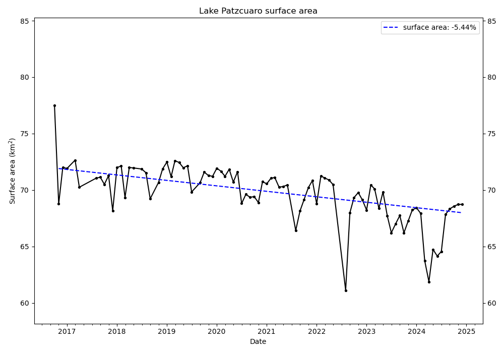

# Remote sensing: determine the area of lakes

This project uses remote sensing techniques to extract the surface of lakes
from stellite Earth observations and study the evolution of their surface with
time. The project is based on Earth observations from the Copernicus Sentinel-2
mission (https://sentinels.copernicus.eu/web/sentinel/copernicus/sentinel-2).
However, with a little bit of work, it could be adapted to other Earth
Earth observations. The GitHub repository is
[here](https://github.com/qsalome/lake_surface_area_evolution).

## Install

The project is based on Python 3.10. I recommend to use conda and the provided
`environment.yml` file:

    $ conda env create -f environment.yml

## Data

The project uses Copernicus Sentinel-2 at 60m resolution that are accessed via
the Sentinel Hub API of the Copernicus database.

You first need to configurate a new sentinelhub `SHConfig` object. You can use
the provided `sentinelhub_config.py` script which will create the configuration
file ``~/.config/sentinelhub/config.toml``.

You will need to replace `your_sh_client_id` with your client ID and
`your_sh_client_secret` with your client secret. To obtain these credentials,
you can follow the instructions in the documentation of the Sentinel Hub API
[here](https://documentation.dataspace.copernicus.eu/APIs/SentinelHub/Overview/Authentication.html).

## Simple example

To extract the monthly lake surface over time:

    $ python extract_lake_area_in_time.py --sampling monthly

By default, the script covers the period between 1st October 2016 and the
current day. To cover the full 2017 year:

    $ python extract_lake_area_in_time.py --sampling monthly --beginning '2017-01-01' --end '2017-12-31'

To plot the evolution of the lake surface in time:

    $ python plot_area_evolution.py

The scripts to extract and plot the lake surface use a dictionary of lakes
(for instance `data/lakes_mexico_catalogue.json`). To visualise the location
of the lakes, with the evolution of their surface, a script allows to
create an interactive map:

    $ python interactive_map.py

The html file can be seen and explored
[here](html/map_lakes_mexico.html)

## Bugs and development

I welcome all changes/ideas/suggestion, big or small, that aim at improving
the projects. Feel free to fork the repository on GitHub and create pull
requests.
Please report any bugs that you find
[here](https://github.com/qsalome/lake_surface_area_evolution/issues).

